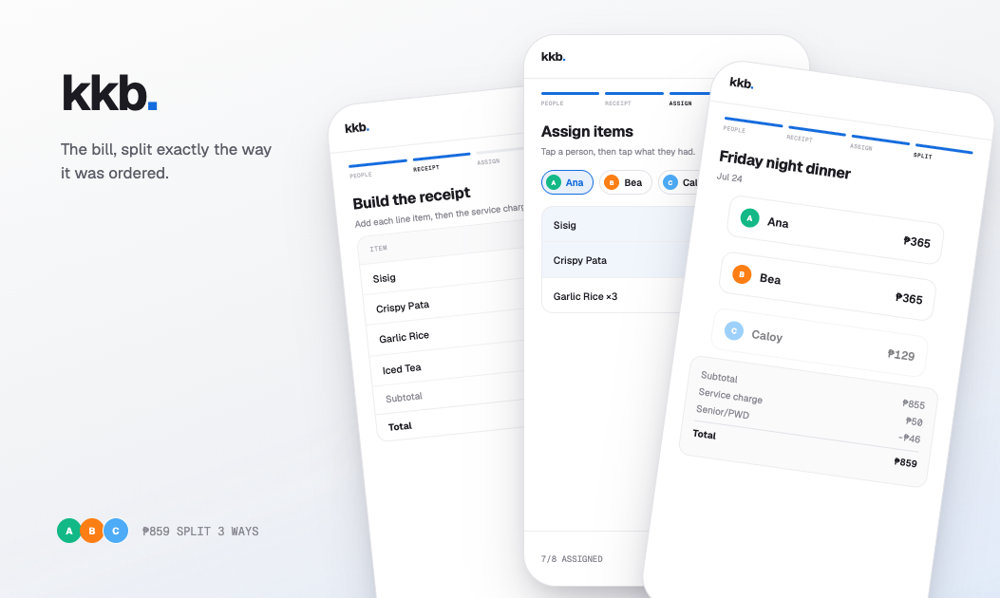

# kkb

A bill-splitting app for group receipts — enter or scan a receipt, assign items (even shared ones) to people, and get an exact per-person total with service charge and discounts factored in.


**[Live demo →](https://kkb-drvii.vercel.app/)**



## Features

- **Manual or AI-scanned receipt entry** — photograph or upload a receipt and Gemini Flash-Lite (AI-powered OCR) extracts items, prices, service charge, and discounts into the app's own data format
- **Per-unit item assignment** — each item quantity splits into individually assignable units, so a shared plate can be split across multiple people
- **Service charge and discounts** — equal-split service charge, plus per-person discounts (e.g. PWD/Senior Citizen) that can target everyone or specific people
- **Paid tracking** — mark each person as paid once they've settled up
- **History** — past splits are saved locally, can be renamed, and reused as a starting point for a new split
- **PNG export** — download a shareable snapshot of the final split
- **Dark/light theme**


## Stack

Next.js 16 (App Router) · React 19 · TypeScript · Tailwind CSS 4 · Zustand (persisted to localStorage, no database) · Gemini API for receipt scanning

## Architecture decisions

Notable domain and technical decisions are recorded as ADRs in `[docs/adr](docs/adr)`.

## Running locally

```bash
npm install
npm run dev
```

Open [http://localhost:3000](http://localhost:3000). Receipt scanning requires a `.env` (see `.env.example`):

```bash
GEMINI_API_KEY=   # https://aistudio.google.com/apikey
SCAN_PASSCODE=    # shared passcode required to call /api/scan-receipt
```

